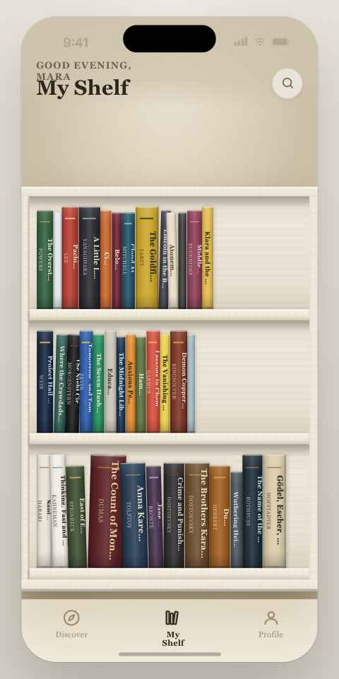
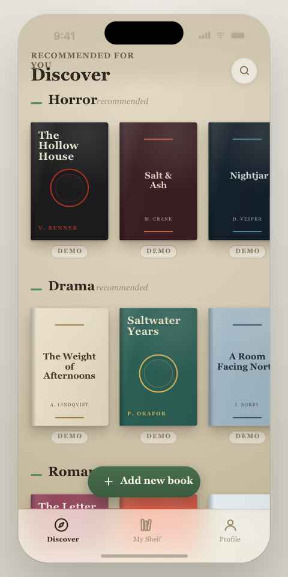
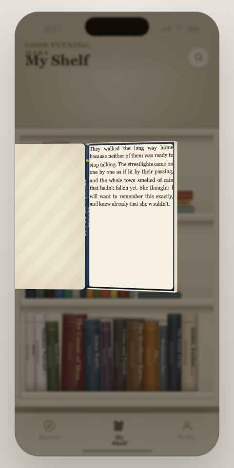
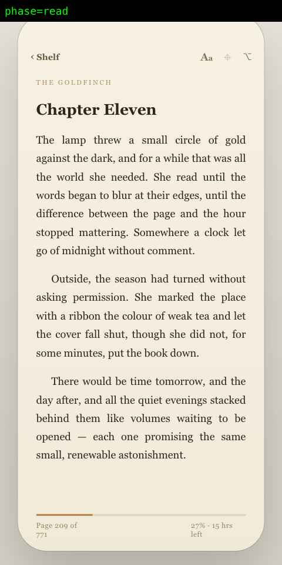

# MyBookshelf

🚧 **Work in progress.** Built with [Claude](https://claude.ai) and Claude Design.

A realistic, interactive digital bookcase prototype built in React and rendered inside an iOS device frame. It visualizes a personal library with physically accurate millimeter dimensions (height, thickness, and width derived from real page counts), lifelike 3D spine lighting, wood-grain shelf themes, and a cinematic 3D book-opening transition into a full e-reader view.

The whole thing is a **zero-build prototype** — no npm, no bundler, no compile step. React, ReactDOM, and Babel are loaded from a CDN, and `.jsx` files are transpiled live in the browser. Just serve the folder over HTTP and open `myBookshelf.html`.

## Screenshots

<p float="left">
  
  
  
  
</p>

## What it does

- **Shelf view** — a wooden bookcase (warm white / light oak / dark walnut themes) holding rows of book spines. Every spine's width and height is computed from that book's real-world dimensions, so a 1,276-page hardback (*The Count of Monte Cristo*) visibly dwarfs a slim paperback next to it.
- **Tap a spine** — triggers a 4-phase cinematic animation: the book **rises** off the shelf, **turns to face** the reader and scales up, its cover **swings open**, then the view **crossfades** into a full-page reading interface — all rendered as a real 6-sided 3D CSS box (`preserve-3d`), not a flat sprite.
- **Reading view** — typography-focused page with a progress bar, "time left" estimate, and chapter heading, seeded from each book's page count and an excerpt.
- **Discover tab** — horizontal genre carousels (Horror, Drama, Romance, Mystery, Science Fiction) of placeholder demo covers, plus a floating "Add new book" button.
- **Profile tab** — placeholder screen ("Coming soon").
- **Live Tweaks panel** — an in-app control panel for adjusting bookcase material, wood grain intensity, spine label density (title+author / title only / none), and animation speed, without touching code.

## Tech stack

- React 18 + ReactDOM 18 (development builds via unpkg CDN)
- Babel Standalone for in-browser JSX transpilation
- Plain CSS-in-JS (inline styles) — no CSS framework
- Google Fonts: *Spectral* and *EB Garamond*
- No build tooling of any kind (no Vite, Webpack, npm scripts)

## Project structure

```
MyBookshelf/
├── myBookshelf.html   # Entry point: loads CDN scripts, sets device scale, mounts <App/>
├── data.js            # Book catalogue — titles, authors, real mm dimensions, colors, excerpts
├── ios-frame.jsx       # iOS-style device frame, status bar, and bezel chrome
├── tweaks-panel.jsx    # Live in-app parameter panel (useTweaks hook + controls)
├── spine.jsx           # SpineFace, CoverArt, ShelfSpine, Book3D — all book rendering
├── shelf.jsx           # Bookshelf/MB_Shelf geometry, wood themes, grain texture, stacks
├── discover.jsx        # Discover tab: genre rows of demo covers + "Add book" button
├── reader.jsx          # Reader (shelf → open → read transition) + ReadingView
├── app.jsx             # Root App: tab navigation, header, tab bar, tweaks wiring
├── screenshots/         # UI captures and animation sequence probes
├── uploads/             # Reference sketches and UI mockups
└── scraps/              # Design scratch files and napkin sketches
```

Scripts are loaded in a strict order in `myBookshelf.html` (`data.js → ios-frame → tweaks-panel → spine → shelf → discover → reader → app`) because there's no module system — each file attaches its components to `window` via `Object.assign(window, {...})`, and later files depend on earlier ones being already defined.

### Design reference

`uploads/` isn't build output — it's kept intentionally as the design record for this project: early sketches and UI mockups showing the skeuomorphic direction (wood-grain shelves, realistic spine lighting, physical page/cover textures) that the React implementation was built to match.

## Key ideas worth knowing

- **Dimensional honesty**: `data.js` stores each book's real cover height (`heightMM`) and derives spine thickness (`thickMM`) from page count and binding (hardback vs. paperback) via `thick(pages, hard) = pages * 0.052 + (hard ? 7 : 2)` mm, clamped to a minimum of 8mm. Cover width defaults to `0.64 * heightMM` when not given. Everything scales from a single constant (`MB_PXMM` / `MB_SCALE`) so relative proportions stay physically plausible at any zoom level.
- **3D book box**: `Book3D` in `spine.jsx` builds a real 6-face cube (back cover, spine, fore-edge with page-texture gradient, top/bottom pages, hinged front cover) using `transformStyle: 'preserve-3d'`, driven by a single `open` angle (0° closed → -150° open) and an outer `transform` string for position/rotation/scale.
- **Reader animation**: `Reader` in `reader.jsx` is a small phase state machine (`rise → face → open → read`, reversible via `closeCover → return`) that computes the exact on-screen origin of the clicked spine and animates the 3D book from that bounding box to stage-center and back, with a `speed` multiplier threading through every timeout and CSS transition.
- **Tweaks protocol**: `useTweaks` posts `postMessage` events to a parent host (an external "edit mode" tool) on every change, so the prototype can be live-tuned from outside the iframe. Defaults are wrapped in `/*EDITMODE-BEGIN*/ ... /*EDITMODE-END*/` markers so that external tool can safely rewrite them.

## Running locally

Babel Standalone fetches `.jsx` files via `fetch`/XHR, so the project must be served over HTTP — opening `myBookshelf.html` directly via `file://` will not work.

```bash
# Option 1: Python 3
python3 -m http.server 8000

# Option 2: Node
npx serve .
```

Then open:

```
http://localhost:8000/myBookshelf.html
```

## Known gaps / in-progress bits

- `MB_STACKS` (decorative horizontal book stacks defined in `app.jsx`) is built but not currently wired into the `<Bookshelf>` call, so it doesn't render.
- Each shelf in `data.js` holds 12–13 books, but only the first 8 per shelf are shown (`app.jsx`'s `.slice(0, 8)`) to fit the 402px-wide device frame — the rest of the catalogue exists in data but isn't currently displayed.
- Discover tab covers are decorative placeholders (no `onClick`, no `pages`/`excerpt` data) and aren't wired to the Reader.
- Profile tab is a static "Coming soon" placeholder.
